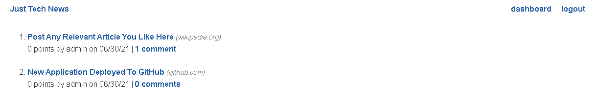

# python-newsfeed

## Description

A simple newsfeed application developed using Python and Flask.

## Table of Contents

- [Code Utilized](#code-utilized:)
- [What to Expect](#what-to-expect:)
- [Rendered Website](#rendered-website:)
- [License](#license:)
- [Lessons Learned](#lessons-learned:)

## Code Utilized

Python News Feed was created using Python, Flask, SQLAlchemy, and MySQL.

## What To Expect

When the user opens the application, they are greeted with a landing page of article titles and an option to log in located in the upper right of the page.
If the user has logged in, they can post their own articles as well as comment and upvote on others.
On posts the user has creted, they have the option to edit and delete if they so choose.

## Rendered Website

<a href="https://python-newsify.herokuapp.com/" target="_blank">Click here to view the website!</a>

## License

This project is using MIT.

## Lessons Learned

Having finished a full stack development path focusing on Node.js, I thought it would be beneficial to branch out to other technologies. Having done just that, I really enjoyed
the entire Python stack as a whole. There are a lot of built-in elements that really makes the process seamless and quite enjoyable. Looking back at the overall experience, I will
absolutely be making more Flask applications in the future.